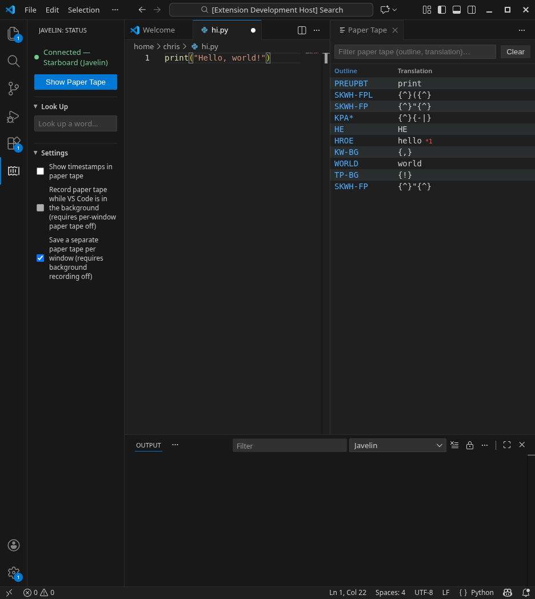

# Javelin Paper Tape

A VS Code extension that shows a live paper tape for
a connected [Javelin](https://github.com/jthlim/javelin-steno) keyboard.



## Installation

This extension isn't published to the VS Code Marketplace. Download the `.vsix` file matching
your OS and CPU from the [Releases page](https://github.com/Chris-Peralta/javelin-vs-code/releases):

| File | Platform |
| --- | --- |
| `javelin-paper-tape-<version>-win32-x64.vsix` | Windows (64-bit) |
| `javelin-paper-tape-<version>-darwin-x64.vsix` | macOS (Intel) |
| `javelin-paper-tape-<version>-darwin-arm64.vsix` | macOS (Apple Silicon) |
| `javelin-paper-tape-<version>-linux-x64.vsix` | Linux (64-bit) |
| `javelin-paper-tape-<version>-linux-arm64.vsix` | Linux (ARM64) |

Then in VS Code:
- Open the Command Palette (Ctrl or Cmd + Shift + P)
- Select "Extensions: Install from VSIX..."
- Select the downloaded file

### Linux

Additional setup may be required if you have never used the Javelin Web Tools.
See the troubleshooting section for details.

## Usage

Click the Javelin icon in the activity bar (left side).

**Settings**:

- **Show timestamps in paper tape** — adds a time column to each row.
- **Record paper tape while VS Code is in the background** — keeps recording strokes
  even when the window isn't focused.
- **Save a separate paper tape per window** — persists the tape so it survives
  closing and reopening the window.

The last two are mutually exclusive.

## Development

```bash
npm install
```

Press **F5** (or Run → Start Debugging) to launch an Extension Development Host with
the extension loaded. This runs the `npm: compile` task first, then opens a new VS Code
window — run the **Javelin: Show Paper Tape** command there to try it out. Use
`npm run watch` to recompile on save while debugging.

# Contributions

- [Javelin](https://github.com/jthlim/javelin-steno) - [jthlim](https://github.com/jthlim/)
- [Javelin WebHID library](https://github.com/ServerBBQ/javelin-webtools/blob/main/lib/javelinHidDevice.ts) - [ServerBBQ](https://github.com/ServerBBQ/)

# Troubleshooting

## Connection issues

### Linux

On Linux, this extension requires the same setup as [Javelin's web tools](https://lim.au/#/software/javelin-steno-tools), so
if you're seeing issues then open a console and run these commands:

**Copy** the udev rule shown in the Javelin view in the activity bar (it appears there when a connection fails).

Type the below command and paste the above into the file.

```bash
sudo nano /etc/udev/rules.d/99-javelin.rules
```

Reload the rules:

```bash
sudo udevadm trigger
```

These are the same commands as the javelin web tools, so if this doesn't work then
go there and try to connect. If it doesn't work then the web tools have instructions.

## Everything else

Something not working? Go through the following one at a time:

- Update javelin firmware on your keyboard
- Update your computers OS
- Update VS Code
- In VS Code click `OUTPUT` > `Javelin`, look for errors
- Make an issue on GitHub and share the errors